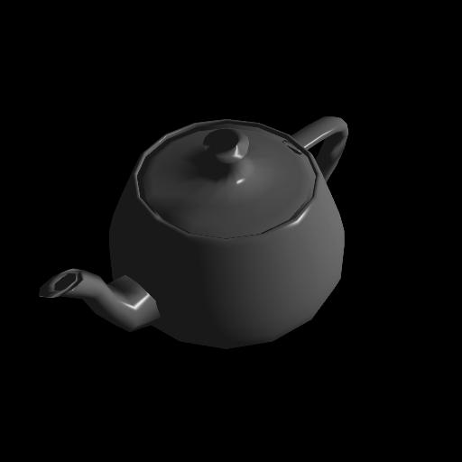
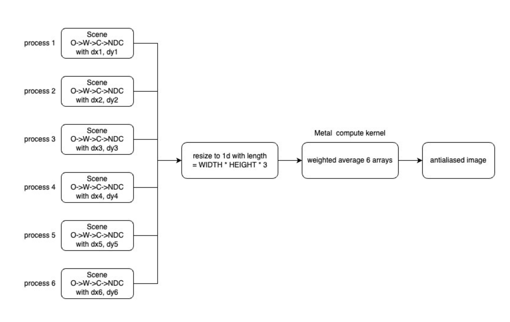

# Rendering and Anti-Aliasing using Apple Metal API and Parallel Pipeline

For this project, the aim was to recreate an extension of a [previous project](https://github.com/ptrbui/3d-graphics-projects)
involving rendering a teapot and including an anti-aliasing filter, with a focus on performance enhancement. This was achieved
by porting the rendering process to the GPU and utilizing [Apple’s Metal API](https://developer.apple.com/metal/). The overall
goal was to enhance the user experience by accelerating the rendering process. The approach involved analyzing the existing
rendering pipeline, identifying tasks suitable for GPU offloading, and integrating the Apple Metal API into the codebase.
Performance was benchmarked by measuring the speedup achieved through GPU rendering.

An example output from the project:

<p align="center" width="100%">
    
    
</p>
<p align="center">
    The images are the same, but rendering with pipelining produces the image in less time.
</p>


## Design + Architecture
Below is a block diagram of the architecture of our project. More specifically, the design for it to run in parallel, or
concurrently, as opposed to consecutively.


<p align="center" width="100%">
  
</p>
<p align="center">
    Block diagram of the project architecture.
</p>


The sequential version of this project mirrors the original assignment, where the six dx, dy values of the anti-aliasing
filter are applied to the teapot one by one. Each jittered sample is taken using the corresponding dx, dy values and rendered
in sequence, resulting in multiple teapot images. However, only the final “combined” teapot is rendered in this project.

For the parallel version, six processes run concurrently, each manipulating the coordinates for proper rendering. Within
each process, the teapot coordinates are transformed from object space to world space, to camera space, and then to NDC
space, incorporating the corresponding dx and dy values.

Each teapot image is then resized to a one-dimensional array with a size of width * height * 3, representing the RGB values
of the image. This array format is necessary for processing by the Metal compute kernel, which is a low-level processor
contributing to the performance speed. The six arrays are averaged by their corresponding weights to obtain the final combined
array, which is then used to render the image.


## Prerequisites

Make sure you have the following installed on your UNIX/macOS machine:

- Python3
- pip

## Installation and Usage

Open the terminal and run the following shell script to set up and run the project:

### Render by default 512 * 512 one teapot
```bash
chmod +x run.sh
./run.sh
```

### Render by a specified resolution
```bash
chmod +x run_args.sh
./run_args.sh width height
```

### Computing Performance with Increasing Image Size
```bash
chmod +x test_dim.sh
./test_dim.sh
```

### Computing Performance with More Teapots
```bash
chmod +x test_geom.sh
./test_geom.sh
```

